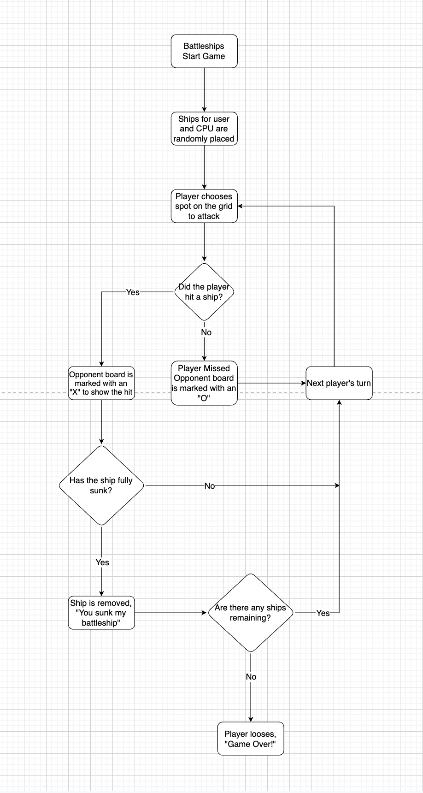
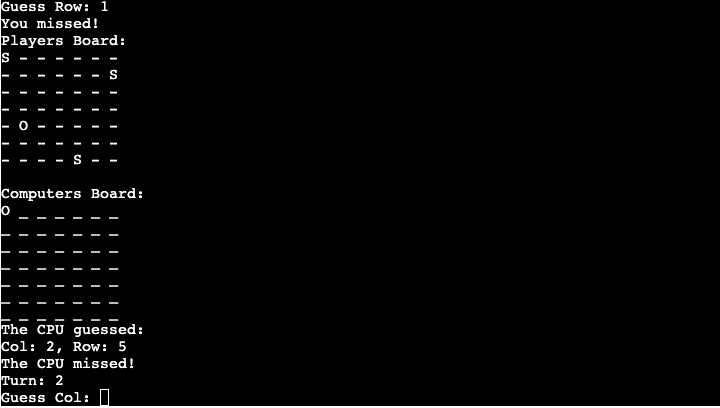
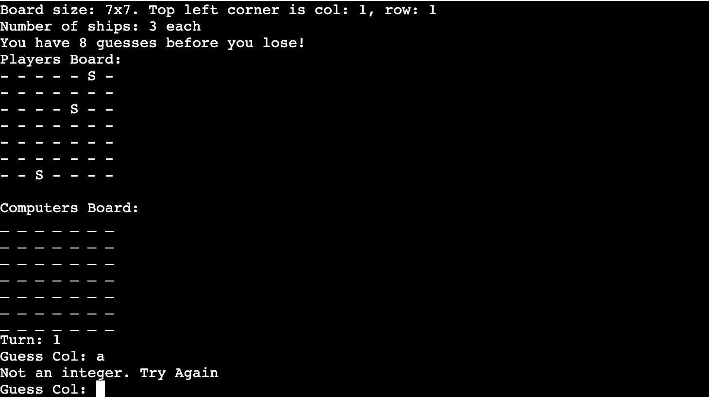
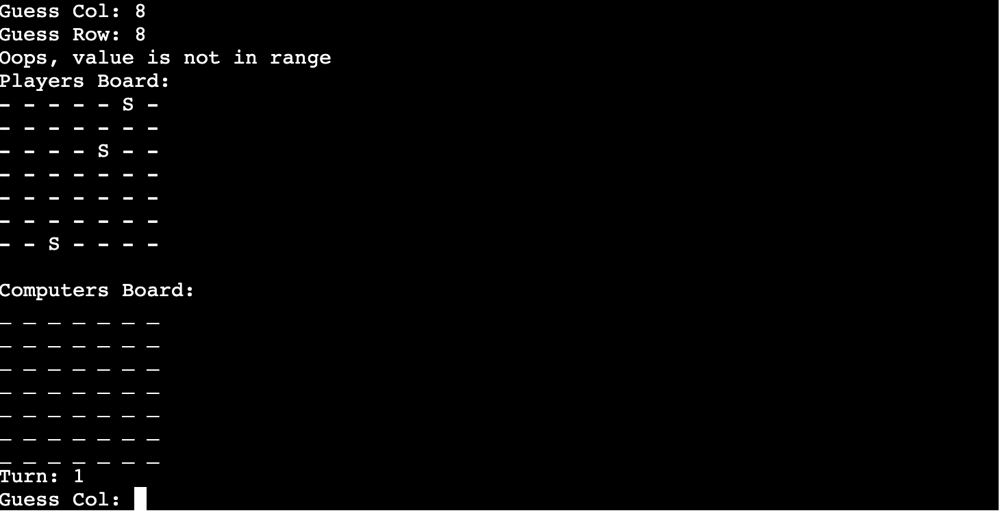
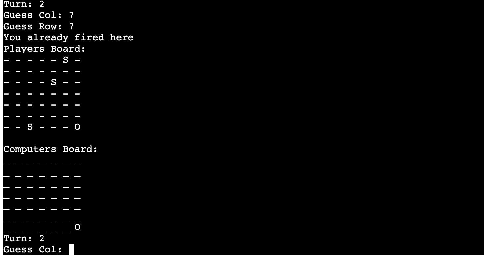
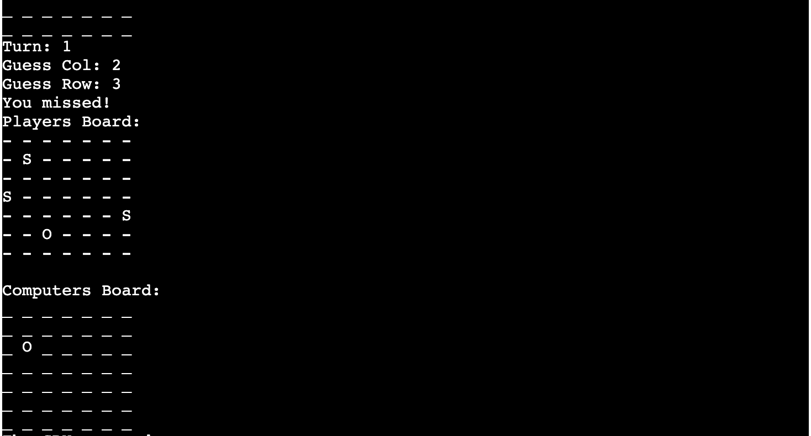
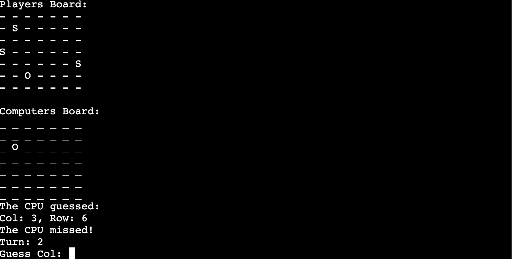
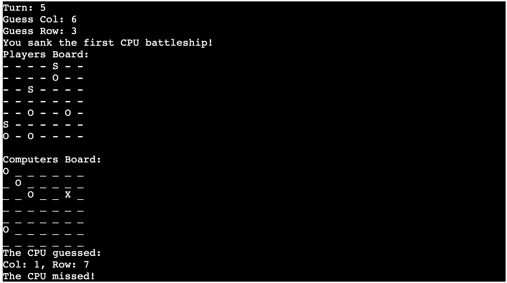
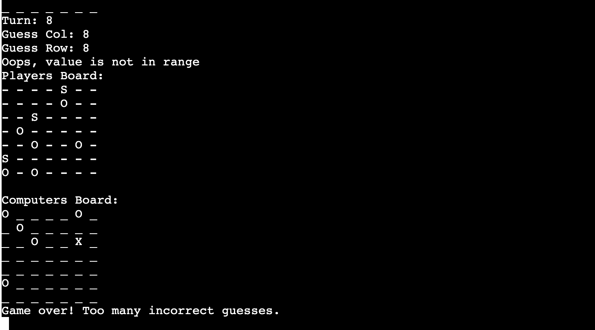

# Battleships

## Introduction

Welcome to my third project in form of a simple battleship game which has been developed using python programming language and can run on Heroku terminal. The main goal of the player is to attempt winning against computer by being the first to find out all battleships.

EDIT

A live version of the game can be found [here](https://battleshipsco-5c6fdaa9c09d.herokuapp.com/).

## Strategy

### Project Goals

The main aim of this game is to develop a fun and interactive computer game using Python for user interaction as well as to demonstrate the basic usage of Python. The player will compete against computer thereby adding more excitement to the game.

### User Goals:

First Time Visitor Goals

      - As a first-time visitor, I want to be engaged with the concept of the game.

Being a first-timer, I would like to understand the game rules easily.
I’d like to win it for the first time in my life.

Returning Visitor Goals

- As a Returning Visitor, I want to beat the cpu.

Frequent User Goals

- As a Frequent User, I want to check to see if there are more features added.

### User Expectations:

The game should be engaging and display a winner and loser.
The game is fun to play
The instructions are clear and simple to follow.

## Structure

Below is a diagram showing the logic and possibilities for this game.

## How to play

The user enters a value 0-7 which marks ships on the board. Eight guesses are allowed by the user; the game ends when all guesses are used up. On this board, their ships are marked. On the opponent’s board, missed guesses are marked with an “O” while hits are indicated by an “X”.

## Features

### Existing Features

- Random ship generation

 - The user and computer ships are generated randomly onto the board.

 - The user's ship location will be printed to the user's board, this is marked with an "S"

 - Multiple battleships - each opponent has 3 ships to guess

- Play against the computer, the computer will automatically return with a guess after the users guess

- Accepts user input

- Input validation

    - You can only enter numbers/integers

    

    - Error message when user enters a value that is not in range

    

    - Error message when user enters the same coordinates repeatedly

    

### Future Features

 - Allow player to set grid

 - Allow player to position the shipsthemselves

## Testing

I have manually tested this project by the following:

- Entered incorrect inputs into the terminal to make sure the correct warning messages are appearing

- During the coding process, I ran the project through the terminal each time to make sure the functions I'm creating is working

- Tested the project on Heroku

### Bugs

#### Solved Bugs

- Trying to guess the values of row: 7, col: 7 was returning the value not in range error. This was rectified by - 1 to the guessing logic.

- The turn counter started at 0. This was rectified by adding + 1 to the turn counter.

- CPU guessed incorrectly but their guess marked the user board with an X. Fixed by making sure the code to display an X on the user board appeared in this order: board cpu_guess_row cpu_guess_col

### Remaining Bugs

- No bugs remaining

### Validator Testing

- [PEP8](http://pep8online.com/)

I ran the code through the PEP8 validator. I initially ran into a few issues, as you can see in the image below:

However, these issues were rectified by adding white spaces around operators and starting new lines of code as the line was too long. 

## Deployment

I used Heroku to deploy my final project to the cloud. To do this I had to:

1. Push all latest code to GitHub.

2. Go to [Heroku](https://dashboard.heroku.com/apps)

3. Select new in the top right corner.

4. Create new app.

5. Enter the app name and select Europe as the region.

6. Connect to GitHub.

7. Search for repo-name.

8. Select connect to the relevant repo you want to deploy.

9. Select the settings tab.

10. Add buildpack

11. Select Python, then save changes.

12. Select Nodejs, then save changes.

13. Make sure Heroku/Python is at the top of the list, followed by Heroku/Nodejs

14. Navigate to the deploy tab

15. Scroll down to Manual Deploy and select deploy branch.

## End Product

Please find below some screenshots of the finished project:

User misses shot:

Computer misses shot:

User sunk first CPU ship:

Too many incorrect guesses:

User wins game:

## Credits

- GitHub Python Template [Code Institute](https://github.com/Code-Institute-Org/python-essentials-template)

- Heroku deployment instructions from Code Institute
